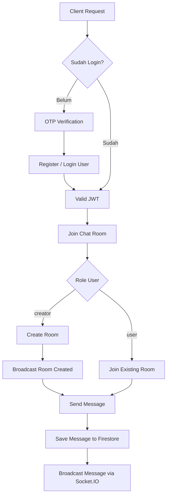

WkwkChat
========

------------------------------------------------------------

FITUR UTAMA
-----------

- Autentikasi Aman
  - Login & register via OTP WhatsApp
  - Password terenkripsi (bcrypt)
  - JWT untuk HTTP & Socket

- Sistem Role
  - user     : join room & kirim pesan
  - creator  : buat room & kirim pesan

- Chat Room
  - Join room via Room ID
  - Creator dapat membuat room
  - Chat real-time (Socket.IO)

- Firebase Firestore
  - Data user & role
  - Data room
  - Riwayat pesan

- Realtime Event
  - Join / leave notification
  - Broadcast pesan ke semua user dalam room

------------------------------------------------------------

TECH STACK
----------

Frontend:
- Vue 3 (Composition API)
- Vue Router
- Socket.IO Client
- JWT Decode

Backend:
- Node.js
- Express
- Socket.IO
- Firebase Admin SDK
- Baileys (WhatsApp Web API)
- JWT
- bcryptjs

Database:
- Firebase Firestore

Deployment:
- NAT VPS / VPS kecil
- PM2 (recommended)
- Nginx (opsional)

------------------------------------------------------------

STRUKTUR PROYEK
---------------

``` md
WkwkChat/
|
├── public/
├── firebase/
|   ├── firebase.js
|   └── firebaseHelper.js
|
├── whatsapp/
|   └── baileys.js
|
├── utils/
|   └── allFunction.js
|
├── main.js
├── .env
└── package.json

```

------------------------------------------------------------

LOGIKA ALUR SISTEM (FLOWCHART)
-----------------------------

Diagram berikut menjelaskan alur logika utama WkwkChat



----------------------------------------------------------

CARA MENJALANKAN
----------------

Install dependency:
npm install

Jalankan server:
node main.js

Rekomendasi (PM2):
npm install -g pm2
pm2 start main.js --name wkwkchat
pm2 save

------------------------------------------------------------

SOCKET EVENT
------------

Client ke Server:
- create-room
- join-room
- send-message

Server ke Client:
- room-created
- joined
- message
- system
- error

------------------------------------------------------------

HAK AKSES ROLE
--------------

Role     | Join Room | Kirim Pesan | Buat Room | Hapus Room
---------|-----------|-------------|-----------|------------
user     | Ya        | Ya          | Tidak     | Tidak
creator  | Ya        | Ya          | Ya        | Tidak

------------------------------------------------------------

CATATAN PENTING
---------------

- Belum ada pagination chat
- NAT VPS menggunakan port custom (bukan 80/443)
- Tidak disarankan untuk trafik besar tanpa optimasi

------------------------------------------------------------

ROADMAP (OPSIONAL)
------------------

- Load chat history saat join room
- Admin panel
- Typing indicator
- Read receipt
- Kirim file & gambar
- Rate limit socket

------------------------------------------------------------

LICENSE
-------

MIT License
